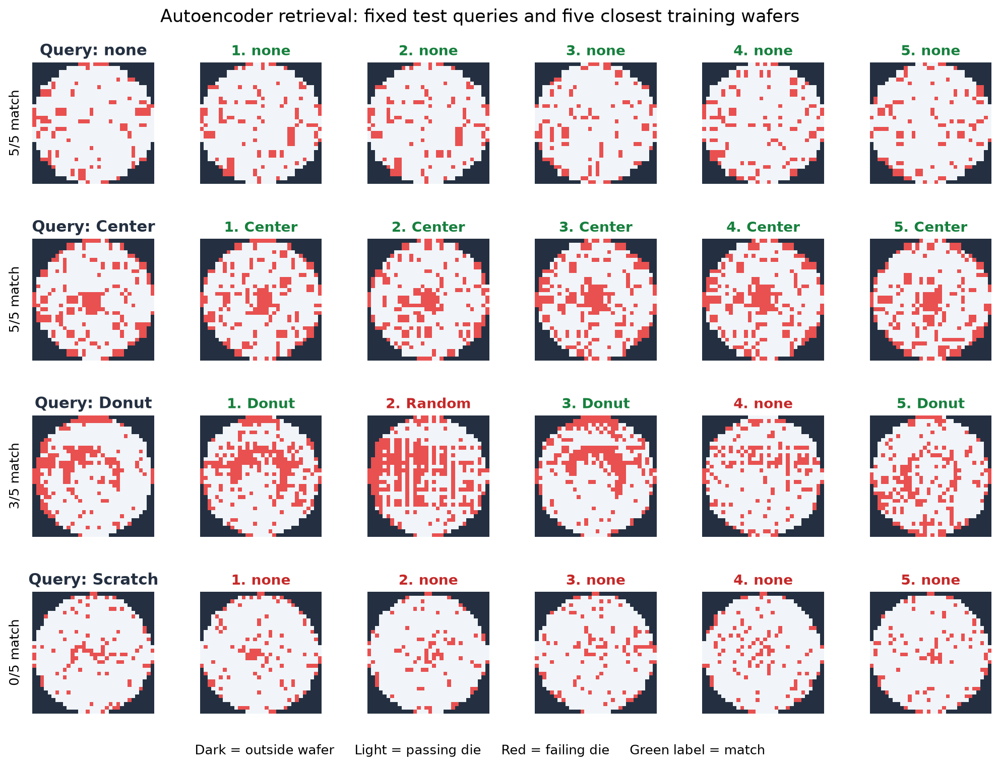

# Wafer Map Similarity Search



A wafer map shows which chip locations passed or failed a test. This project
retrieves five historical wafers with similar failure patterns from the labeled
WM-811K data. It compares hand-designed spatial features with 64-number
embeddings learned by a PyTorch convolutional autoencoder.

In the demo, each row starts with a fixed-seed test wafer. The five images to
its right are the closest wafers in the training database. Green labels match
the query label; red labels differ. The query was never in the database.

## Results

Precision@5 is the fraction of five retrieved neighbors whose label matches
the query. Each score below is the mean ± standard deviation over three
stratified train/test splits. Within each split, all three methods use the
same database and test queries. The full results and query counts are in
[the comparison report](results/m5_report.md).

<!-- RESULTS_TABLE_START -->

| Query class | Queries per split | Random | Handcrafted | Autoencoder |
|---|---:|---:|---:|---:|
| none | 2000 | 0.852 ± 0.003 | 0.975 ± 0.002 | 0.986 ± 0.003 |
| Center | 859 | 0.025 ± 0.002 | 0.784 ± 0.014 | 0.803 ± 0.010 |
| Donut | 111 | 0.002 ± 0.002 | 0.704 ± 0.028 | 0.707 ± 0.018 |
| Edge-Ring | 1936 | 0.057 ± 0.003 | 0.909 ± 0.009 | 0.951 ± 0.003 |
| Edge-Loc | 1038 | 0.031 ± 0.001 | 0.377 ± 0.006 | 0.463 ± 0.012 |
| Loc | 718 | 0.021 ± 0.003 | 0.264 ± 0.008 | 0.303 ± 0.012 |
| Scratch | 239 | 0.009 ± 0.004 | 0.052 ± 0.015 | 0.121 ± 0.003 |
| Random | 173 | 0.008 ± 0.004 | 0.812 ± 0.006 | 0.826 ± 0.025 |
| Near-full | 30 | 0.000 ± 0.000 | 0.920 ± 0.024 | 0.831 ± 0.038 |
| Macro, defects | — | 0.019 ± 0.001 | 0.603 ± 0.003 | 0.626 ± 0.003 |

<!-- RESULTS_TABLE_END -->


The autoencoder has the higher mean on most classes. The handcrafted baseline
is better on Near-full, which has few test queries. Scratch remains difficult
for both approaches. The [confusion tables](results/m5_confusion_autoencoder.csv)
show where retrieved labels differ from query labels.

## How it works

The processed 32×32 map uses three integer values: `0` outside the wafer,
`1` for a passing die, and `2` for a failing die. The autoencoder converts
these into three input channels. Its encoder compresses each map to 64 numbers;
its decoder learns to reconstruct the original map. After training, the
encoder supplies the 64-number embedding used in nearest-neighbor search.

The baseline instead measures radial failure density, direction, global
statistics, and line-like patterns. Both methods use Euclidean distance to
find the five closest database wafers. Random retrieval provides a chance
reference.

## Reproduce

Place `LSWMD.pkl` in the project root. It and the generated arrays and model
checkpoints remain local; Git tracks the code, small result files, and figures.
Run the commands from the project root:

```bash
python3 -m venv .venv
source .venv/bin/activate
python -m pip install -r requirements.txt
python -m pip install -e .
python scripts/check_setup.py
MPLCONFIGDIR=.cache/matplotlib python scripts/process_wm811k.py
python scripts/check_random_retriever.py
python scripts/run_baseline_dev.py
python scripts/check_autoencoder_overfit.py
MPLCONFIGDIR=.cache/matplotlib python scripts/train_m5_models.py
MPLCONFIGDIR=.cache/matplotlib python scripts/run_m5_comparison.py
MPLCONFIGDIR=.cache/matplotlib python scripts/build_retrieval_demo.py
python scripts/render_readme_results.py
pytest
```

The first processing run creates the local 32×32 array cache. Model training
uses all defect wafers in the fit split plus a sample of 5,000 `none` wafers,
with a separate development split for checkpoint selection. The comparison
embeds the full training database, including the `none` class. Existing
checkpoints are reused by the training launcher.

## Limits

The labels measure agreement with human-assigned defect categories, not shared
manufacturing causes. Wafers from the same production lot may be similar,
so a random split can make retrieval scores optimistic. Resizing to 32×32 may
erase thin scratches, and the database contains many more `none` wafers than
rare defects. Near-full has few test queries. The project evaluates retrieval
of known classes; it does not evaluate whether a new defect type can be flagged.
