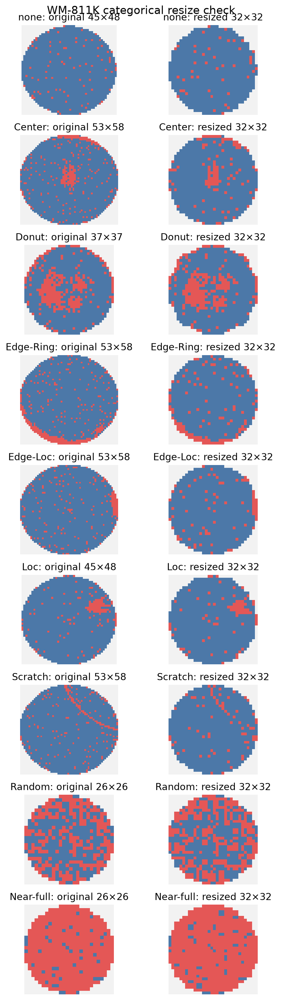
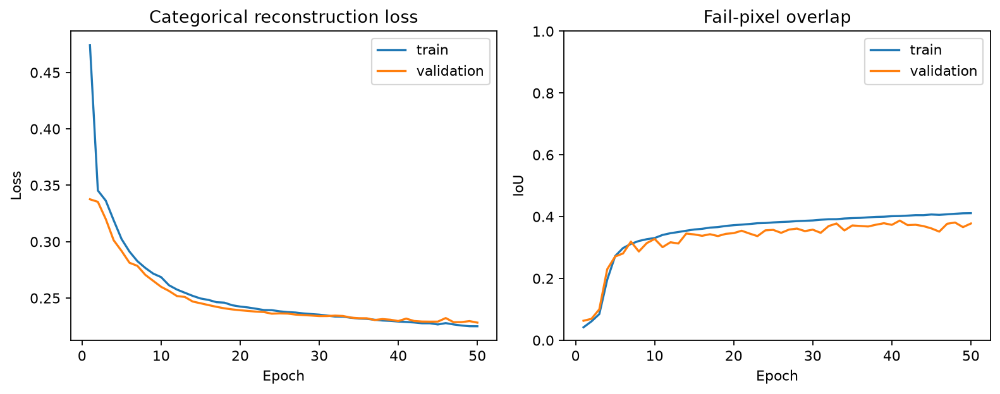
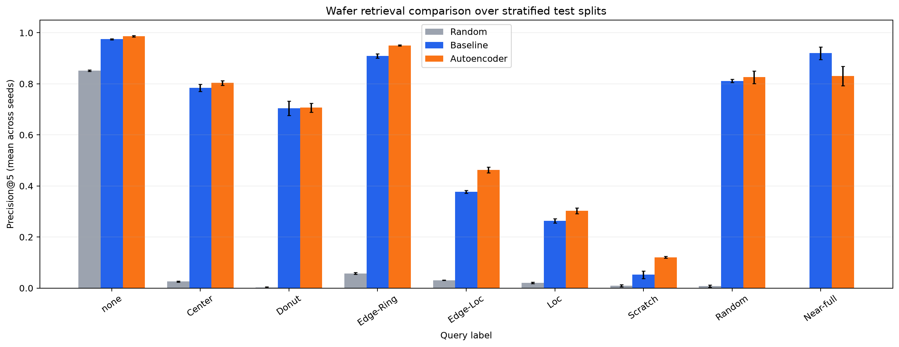

# Wafer Map Similarity Search

This project compares two ways to retrieve historical wafer maps with similar
failure patterns from the WM-811K dataset:

1. spatial features designed by hand, followed by nearest-neighbor search;
2. embeddings learned by a convolutional autoencoder, followed by the same search.

The main metric is per-class precision@5. The project also tests whether distance
to the nearest known wafer can flag a defect class that the model never saw.

## Current status

- M0: project structure, dependencies, fixed random seeds, tests, and
  software-version logging.
- M1: labeled-wafer extraction, categorical 32×32 resizing, local array cache,
  class-count validation, and a visual resize check.
- M2: stratified fit/dev/test splits, capped test-query sampling, per-class
  precision@5, and a random-retrieval sanity check.
- M3: standardized handcrafted spatial features and nearest-neighbor baseline
  retrieval, evaluated on the development split.
- M4: categorical convolutional autoencoder, one-batch overfit verification,
  balanced full training, early stopping, and deterministic 64-number embeddings.
- M5: three-seed test comparison of random, handcrafted, and autoencoder
  retrieval on identical databases and queries, with per-class confusion tables.

Later milestones will add out-of-distribution detection and portfolio figures.

## Setup

```bash
python3 -m venv .venv
source .venv/bin/activate
python -m pip install --upgrade pip
python -m pip install -r requirements.txt
python -m pip install -e .
pytest
python scripts/check_setup.py
```

The raw `LSWMD.pkl` file belongs in the repository root but is intentionally
excluded from Git because it is large and must remain local.

## Prepare the labeled data

```bash
MPLCONFIGDIR=.cache/matplotlib python scripts/process_wm811k.py
```

The command keeps the 172,950 labeled wafers, resizes their maps without
blending the categorical values, and writes the local cache under
`data/processed/`. Raw data and processed arrays are excluded from Git.



## Verify the evaluation harness

```bash
python scripts/check_random_retriever.py
```

This creates a stratified split, samples at most 2,000 test queries per class,
and confirms that random precision@5 is consistent with each class's frequency
in the training database. The generated comparison is saved to
`results/m2_random_sanity.csv`.

## Run the handcrafted baseline

```bash
python scripts/run_baseline_dev.py
```

The first run extracts 36 spatial features for every processed wafer and caches
them locally. The script fits its standardizer and nearest-neighbor database on
fit rows only, uses development rows as queries, and saves per-class precision@5
to `results/m3_baseline_dev.csv`. Test rows remain untouched during feature
design.

## Train the convolutional autoencoder

```bash
python scripts/check_autoencoder_overfit.py
MPLCONFIGDIR=.cache/matplotlib python scripts/train_autoencoder.py
```

The first command verifies that the model can memorize one mixed batch. Full
training uses all fit-split defect wafers and 5,000 sampled `none` wafers, while
the separate development split controls checkpoint selection. Checkpoints stay
local under `checkpoints/`; the training history, summary, and learning curves
are reproducible tracked outputs.



## Compare retrieval methods

```bash
MPLCONFIGDIR=.cache/matplotlib python scripts/train_m5_models.py
MPLCONFIGDIR=.cache/matplotlib python scripts/run_m5_comparison.py
```

The first command trains any missing seed-specific autoencoders with the same
20-epoch budget. All three split checkpoints stay local and are excluded from
Git. The second command gives random retrieval,
handcrafted features, and autoencoder embeddings the same training database and
test queries within each seed. It reports per-class precision@5 as a mean and
sample standard deviation across three stratified split seeds, along with
retrieval-confusion tables that reveal which labels each method confuses.



Across the three splits, defect-only macro precision@5 is 0.603 for the
handcrafted baseline and 0.626 for the autoencoder. The autoencoder has the
higher mean on every class except Near-full, where the baseline scores 0.920
versus 0.831. Near-full has only 30 queries per split, so that comparison is
noisy. Scratch remains the hardest defect for both methods even though the
autoencoder raises its mean precision@5 from 0.052 to 0.121.
